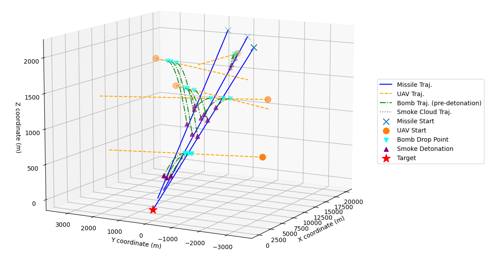

# Optimization of UAV Smoke Countermeasures via Kinematic Simulation

[](https://isocpp.org/)
[](https://cmake.org/)
[](https://opensource.org/licenses/MIT)

🏆 **Awarded Second Prize in the China Undergraduate Mathematical Contest in Modeling (CUMCM), Anhui Division, CSIAM (2025)**.

[English Version] | **[中文版](./README_CN.md)**

> **Note**: This repository contains the core C++ optimization engine and Python visualization framework for our award-winning CUMCM submission.
>
> **💡 Highlight**: For a comprehensive explanation of our mathematical models, kinematic equations, and rigorous algorithm proofs, please refer to our **[Competition Solution Report (PDF)](./docs/Report.pdf)**.

## 📖 Overview

This project implements a high-performance C++ optimization engine for **multi-UAV Smoke Screen Deployment Strategies** under dynamic constraints. Operating on a high-precision **0.1ms discrete-time simulation step**, the strategy effectively models projectile motion, uniform smoke descent, and geometric line-of-sight obstruction. The project progressively scales from a basic kinematic simulation up to a massive **40-dimensional multi-agent cooperative optimization** problem, providing executable tactical commands for real-world battlefield environments.



>   **3D Tactical Visualization**: Rendering of the multi-UAV smoke screen deployment strategy against 3 missiles. 
>   Blue: Missile Trajectories; Orange: UAV Flight Paths; Purple: Detonation Points.

## ✨ Research Highlights & Innovations

Based on rigorous mathematical modeling, the engine implements tailored algorithms to conquer the "curse of dimensionality":

* **1D Kinematic Simulation (Problem 1):** Built a high-precision 0.1ms-step numerical simulation to model dynamic visual contour obstruction. Evaluated effective shielding time: *1.392s*.
* **4D Hybrid Stochastic Optimization (Problem 2):** Designed a Two-stage Hybrid Stochastic Algorithm (Large-scale Monte Carlo global exploration + Multi-round iterative local search) for single UAV/single smoke highly non-linear parameter optimization. Evaluated effective shielding time: *4.589s*.
* **8D Differential Evolution (Problem 3):** Introduced **Differential Evolution (DE)** algorithm using mutation, crossover, and selection to handle 3 smoke screens from a single UAV. Implemented time-interval union logic to flawlessly resolve overlapping shielding periods. Evaluated effective shielding time: *7.6s*.
* **40D Cooperative Co-evolution (Problem 4):** Created a **Cooperative Co-evolution Framework**. Decomposed the ultra-high dimensional problem into independent sub-problems with independent populations, evaluated via a "cooperative fitness" mechanism. 
* **Spatial-temporal Decoupling (Problem 5):** Tackled the ultimate multi-UAV, multi-missile scenario using a "Problem Decoupling - Sub-problem Optimization - Global Integration" strategy. Leveraged spatial-temporal independence and applied **Grid Search** combined with **Local Hill Climbing** to break the computational bottleneck. 

## 🛠 Refactoring Note

This project represents a comprehensive refactoring of the original competition codebase, centered on the **modular decoupling of physical simulation models from optimization heuristics**. By establishing this architectural abstraction, users can seamlessly adapt to diverse combat scenarios or pivot algorithmic strategies via external configurations—all without modifying the underlying kinematic logic. This evolution elevates the project from a localized contest submission to a **highly reusable and versatile tactical simulation engine**.

## 🏗 Project Architecture

```text
UAV-Kinematic-Optimizer/
├── config/
│   ├── config.h           # [Env & Physics] Physical constants and problem presets (Gravity, Missile speed, Step)
│   └── params.h           # [Algorithm Hyperparams] Heuristic tuning and search space (Population size, Mutation rate, Bounds)
├── core/                  
│   ├── problem1.cpp       # 0.1ms high-precision kinematic simulation (Baseline model)
│   ├── problem2.cpp       # 4D parameter optimization: Two-stage Hybrid Stochastic Search
│   ├── problem3.cpp       # 8D parameter optimization: Differential Evolution
│   ├── problem4.cpp       # 12D parameter optimization: Cooperative Co-evolution Framework
│   ├── problem5-grid-search.cpp   # 40D Strategy A: Grid Search based on spatial-temporal decoupling
│   ├── problem5-hill-climbing.cpp # 40D Strategy B: Heuristic Local Hill Climbing optimization
│   └── problem5-simulator.cpp     # 40D Strategy Verification: Multi-UAV/Multi-Missile Kinematic Simulator
├── data/                  
│   ├── problem5-grid-search-strategy.csv   # Format: ID + 3 Target Seq + 2 Params (Speed, Angle)
│   ├── problem5-hill-climbing-strategy.csv # Format: ID + 3 Target Seq + 8 Params (Supports backup rows)
│   ├── problem5-simulator-strategy.csv     # Format: ID + 8 Params (Direct mapping to final_params array)
│   └── results.xlsx 	   # Final Results (Multi-sheet: Interception coordinates for Result 1-3)
├── docs/
│   ├── Problem_A.pdf      # Original Competition Problem (Source of constraints & mission objectives)
│   ├── Report.pdf         # Competition Solution Report (Mathematical modeling & Algorithm proofs)
│   └── images/            # Assets for README (Diagrams and Simulation snapshots)
├── viz/                   
│   ├── requirements.txt   # Python environment dependencies (Numpy, Matplotlib, etc.)
│   └── strategy-visualizer.py     # 3D Trajectory rendering & Shielding effect visualization script
├── .gitignore             # Ignore binaries (bin/, build/) and temporary logs
├── CMakeLists.txt         # Cross-platform build system: One-click compilation for all targets
├── README.md              # Project Documentation (English Version)
└── README_CN.md           # Project Documentation (Chinese Version)
```

## 📊 Data Input Formats

The optimization engine relies on CSV files for cross-module communication. The physical parameters are mapped as follows:

| **Index** | **Variable**        | **Physical Meaning**                                | **Unit** |
| --------- | ------------------- | --------------------------------------------------- | -------- |
| `[ID]`    | `uav_id`            | UAV Identifier (1-5, corresponding to FY1-FY5)      | -        |
| `[0]`     | `uav_speed`         | Horizontal flight velocity of the UAV               | m/s      |
| `[1]`     | `uav_fly_angle_rad` | Flight heading angle                                | rad      |
| `[2]`     | `t_drop1`           | Absolute release time of the 1st smoke screen       | s        |
| `[3]`     | `delay1`            | Fuze delay (release to explosion) for the 1st smoke | s        |
| `[4]`     | `delta_t_drop2`     | Time interval (Δt) between 1st and 2nd release      | s        |
| `[5]`     | `delay2`            | Fuze delay for the 2nd smoke                        | s        |
| `[6]`     | `delta_t_drop3`     | Time interval (Δt) between 2nd and 3rd release      | s        |
| `[7]`     | `delay3`            | Fuze delay for the 3rd smoke                        | s        |

-   **`problem5-simulator-strategy.csv`**: Contains the standard `[ID] + [0~7]` format mapping directly to the `final_params[i]` array.
-   **`problem5-hill-climbing-strategy.csv`**: Adds 3 Target sequence columns (e.g., M2, M1, M3) immediately after the `ID` column, followed by the 8 parameters. *(Note: Only the first valid configuration block is executed; subsequent rows act as backup test samples).*
-   **`problem5-grid-search-strategy.csv`**: Contains the `ID` column, the 3 Target sequence columns, and only the first 2 parameters (Speed & Angle). *(Note: Only the first valid row block is utilized).*

## 🚀 Quick Start

**1. Environment Setup (UCRT64)**

Ensure you have GCC 17+ (for `std::filesystem` and `inline` support) and CMake 3.10+ installed.

**2. Build the Optimization Engine**

```bash
mkdir build && cd build
cmake -G "Unix Makefiles" ..
make -j4
```

**3. Generate Tactical Strategies**

Run the executable via the terminal. **The optimal multi-dimensional parameters and fitness values will be directly outputted to the terminal.** 

```bash
cd ../bin
./problem4.exe > output_log.txt
```

**4. 3D Trajectory Visualization**

```bash
pip install -r viz/requirements.txt
python viz/strategy-visualizer.py
```

## 👥 Authors

-   **Xiangzheng Xi** (School of the Gifted Young, USTC)
-   **Yifan Zhao** (School of the Gifted Young, USTC)